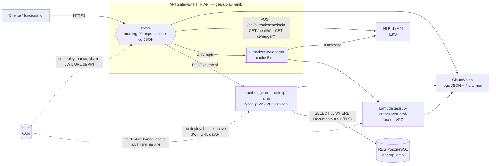

# gearup-lambda-auth

Autenticação **serverless por CPF** e **API Gateway** da plataforma **GearUp** (Tech Challenge FIAP — Fase 3).

## Propósito

- **`POST /auth/cpf`** — função `gearup-auth-cpf-<ambiente>` que:
  1. valida o CPF (formato e dígitos verificadores, mesmo algoritmo do value object `Documento` da API);
  2. consulta a **existência** do cliente na base (RDS PostgreSQL);
  3. verifica o **status** (cliente ativo × excluído);
  4. **gera e devolve um JWT** válido para as APIs protegidas.
- **Lambda authorizer** `gearup-autorizador-<ambiente>` — barra no gateway qualquer chamada a `/api/*` sem JWT válido.
- **API Gateway (HTTP API)** — porta de entrada única de cada ambiente: roteia `/auth/cpf` para a Lambda e `/api`, `/health`, `/swagger` para a API no EKS, com throttling e access logs.

Decisões: [RFC-003 — Estratégia de autenticação](https://github.com/SOAT-GearUp/gearup-api/blob/master/docs/fase-3/RFC/RFC-003%20-%20Estrategia%20de%20autenticacao.md) · [ADR-002 — API Gateway](https://github.com/SOAT-GearUp/gearup-api/blob/master/docs/fase-3/ADR/ADR-002%20-%20Comunicacao%20sincrona%20via%20API%20Gateway.md).

## Arquitetura



Fluxo detalhado: [Diagramas de Sequência](https://github.com/SOAT-GearUp/gearup-api/blob/master/docs/fase-3/Arquitetura/Diagramas%20de%20Sequencia.md).

## Contrato da API

```http
POST /auth/cpf
Content-Type: application/json
X-Correlation-ID: opcional

{ "cpf": "529.982.247-25" }
```

| Status | `code` | Quando |
|---|---|---|
| 200 | — | `{ "accessToken", "tipo": "Bearer", "expiraEm", "cliente": { "id", "nome" } }` |
| 400 | `CORPO_INVALIDO` / `CPF_INVALIDO` | JSON inválido ou CPF com formato/dígito incorreto (não consulta o banco) |
| 404 | `CLIENTE_NAO_ENCONTRADO` | CPF válido sem cadastro |
| 403 | `CLIENTE_INATIVO` | cliente excluído (`Ativo = false`) |
| 503 | `BANCO_INDISPONIVEL` | falha ao consultar o RDS |

O JWT é **HS256**, `iss=GearUp`, `aud=GearUp.Clients`, `sub` e `cliente_id` = id do cliente, `role=Cliente`, `amr=cpf`, validade de 60 min — idêntico ao emitido pelo login de funcionários da API, que o aceita sem mudanças (teste de contrato em `gearup-api/tests/GearUp.Api.IntegrationTests/Autenticacao/TokenLambdaCpfTests.cs`).

**Swagger e Postman:** o Swagger da API é servido pelo próprio gateway em `https://<gateway>/swagger/index.html` (homologação). A collection [GearUp - Fase 3 - Autenticação CPF](https://github.com/SOAT-GearUp/gearup-api/blob/master/docs/fase-3/Postman/GearUp%20-%20Fase%203%20-%20Autenticacao%20CPF.postman_collection.json) exercita `/auth/cpf` e as rotas protegidas. A URL de cada ambiente aparece no resumo do job de deploy e em `aws ssm get-parameter --name /gearup/<amb>/gateway/url`.

## Tecnologias

Node.js 22 (ESM) · [`jose`](https://github.com/panva/jose) (JWT) · [`pg`](https://node-postgres.com) · `node:test` com cobertura · AWS Lambda · Amazon API Gateway HTTP API · CloudWatch · Terraform ≥ 1.10 · GitHub Actions · Docker (imagem oficial `public.ecr.aws/lambda/nodejs:22` para execução local).

## Estrutura

```text
src/
  autenticar.mjs        entry point  POST /auth/cpf
  autorizador.mjs       entry point  Lambda authorizer
  autenticacao.mjs      regra do fluxo de autenticação (testável, sem AWS)
  autorizacao.mjs       regra do authorizer
  dominio/cpf.mjs       validação e máscara de CPF (LGPD)
  seguranca/token.mjs   emissão/validação do JWT
  dados/clientes.mjs    consulta ao PostgreSQL (pool reaproveitado, TLS)
  infra/                config, logs JSON, utilitários HTTP
test/                   45 testes, cobertura de linhas 100%
terraform/              Lambdas, API Gateway, alarmes (state por ambiente)
local/                  docker compose: Postgres + emulador da Lambda
exemplos/               eventos de teste
```

## Execução local

Testes (Node 22+):

```powershell
npm ci
npm test          # falha se a cobertura de linhas ficar abaixo de 80%
```

Função rodando no emulador oficial da AWS com um Postgres de exemplo (Docker em execução):

```powershell
docker compose -f local/docker-compose.yml up --build -d
curl.exe -s -X POST http://localhost:9000/2015-03-31/functions/function/invocations --data-binary "@exemplos/cpf-ativo.json"
curl.exe -s -X POST http://localhost:9000/2015-03-31/functions/function/invocations --data-binary "@exemplos/cpf-inativo.json"
curl.exe -s -X POST http://localhost:9000/2015-03-31/functions/function/invocations --data-binary "@exemplos/cpf-inexistente.json"
curl.exe -s -X POST http://localhost:9000/2015-03-31/functions/function/invocations --data-binary "@exemplos/cpf-invalido.json"
docker compose -f local/docker-compose.yml down
```

## Deploy

### Pré-requisitos (por ambiente)

Ordem da plataforma: [gearup-infra-k8s](https://github.com/SOAT-GearUp/gearup-infra-k8s) → [gearup-infra-db](https://github.com/SOAT-GearUp/gearup-infra-db) → [gearup-api](https://github.com/SOAT-GearUp/gearup-api) → **este**. A pipeline do gearup-api publica no SSM o que este repositório consome:

| Parâmetro SSM | Publicado por |
|---|---|
| `/gearup/banco/{host,porta,usuario,senha}` | gearup-infra-db |
| `/gearup/<amb>/jwt/chave` | gearup-api (CD) |
| `/gearup/<amb>/api/host` | gearup-api (CD) — hostname do NLB |

### CI/CD

Workflow [`ci-cd.yml`](.github/workflows/ci-cd.yml):

| Evento | O que roda |
|---|---|
| Pull Request | testes + cobertura, `terraform fmt`/`validate` |
| push `homolog` | testes → `scripts/empacotar.sh` → `terraform apply` (homolog) → smoke test (400 no CPF inválido, 401 sem token) |
| push `main` (só via PR) | idem em production |
| Run workflow | `deploy` ou `destroy` de um ambiente escolhido |

Cada ambiente tem sua própria pilha (funções + gateway) e seu state (`lambda-auth/<amb>.tfstate`): Lambda e HTTP API cobram por requisição, então homologação parada custa zero.

**Secrets:** `AWS_ACCESS_KEY_ID`, `AWS_SECRET_ACCESS_KEY`, `AWS_SESSION_TOKEN` (Learner Lab; expiram a cada sessão).

### Manual

O empacotamento usa `bash`, `curl` e `zip` (Linux, macOS ou WSL; o Git Bash do Windows não traz `zip`). O caminho recomendado é a pipeline; manualmente:

```powershell
bash scripts/empacotar.sh
.\scripts\tf-init.ps1 -Chave lambda-auth/homolog.tfstate
terraform -chdir=terraform apply -var "ambiente=homolog"
terraform -chdir=terraform output url_gateway
```

## Observabilidade

A função de autenticação fica em subnet privada **sem NAT** ([ADR-005](https://github.com/SOAT-GearUp/gearup-api/blob/master/docs/fase-3/ADR/ADR-005%20-%20Rede%20sem%20NAT%20Gateway.md)), então é monitorada pelo CloudWatch:

- logs JSON (uma linha por evento, com `correlationId`, `resultado`, `clienteId`, `duracaoMs` e CPF mascarado `***.982.247-**`);
- access log JSON do gateway (`requestId`, rota, status, latências, erro do authorizer);
- alarmes: erros da Lambda, p95 > 2 s, 5xx do gateway e falhas de consulta ao banco (métrica derivada dos logs).

```powershell
aws logs tail /aws/lambda/gearup-auth-cpf-homolog --since 10m --follow
```

## Segurança

- Consulta parametrizada; CPF validado antes de tocar no banco.
- TLS obrigatório até o RDS, validando o certificado com o bundle oficial da AWS.
- Throttling de 20 req/s (rajada 40) contra enumeração e força bruta.
- CPF nunca registrado por inteiro (coberto por teste).
- Função sem nenhuma porta de entrada; saída apenas para 5432 dentro da VPC.

## Custos

Dentro do free tier (Lambda: 1 milhão de requisições/mês; HTTP API: US$ 1 por milhão). Logs com retenção de 7 dias.
